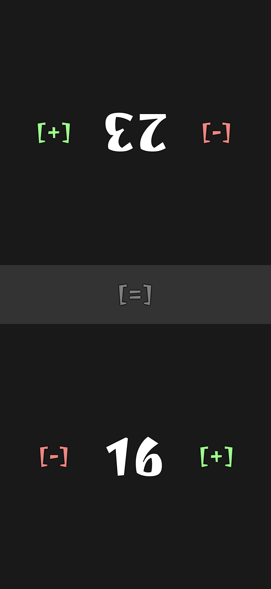

# MTG Counter

A simple [Magic: The Gathering](https://magic.wizards.com) life counter for Android, written in [Lua](https://www.lua.org/) with [Love2D](https://love2d.org/) using [framestack](https://github.com/shagu/framestack). The embedded font is [Joti One](https://fonts.google.com/specimen/Joti+One).

## Clone & Build

Make sure to have java and imagemagick installed:

    pacman -Sy jdk11-openjdk imagemagick

Clone the repositorey:

    git clone --recursive https://github.com/shagu/mtgcounter

Then run the build script:

    ./build.sh

The debug APK can then be found at:

    ./tmp/org.shagu.mtgcounter-debug.apk

## Screenshot

